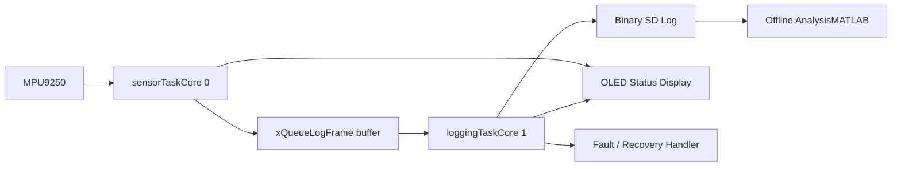

# DeadReckoner

A real-time, offline dead-reckoning and data-logging system built around the **ESP32-S3 N16R8**, the **MPU9250 IMU**, and a **binary SD-card logging pipeline**.

The project started as a small IMU prototype and evolved into a multi-core embedded platform for high-rate sensing, safe storage, fault handling, and offline analysis.

---

## Overview

DeadReckoner is designed to record high-frequency inertial data without relying on live GPS.  
The core system is a pure indoor PDR (Pedestrian Dead Reckoning) data logger. GPS is an **auxiliary extension** used exclusively for outdoor MPU9250 and filter calibration testing — it is **not** part of the core navigation system.

### Core goals

- High-rate IMU acquisition with minimal blocking
- Binary logging to SD card with deterministic frame size (47 bytes)
- Safe shutdown and recovery during hardware faults
- Offline analysis of quaternion and acceleration data

---

## Hardware Stack

| Module                         | Role                      | Notes                                       |
| ------------------------------ | ------------------------- | ------------------------------------------- |
| **ESP32-S3 N16R8**             | Main controller           | Dual-core MCU with 16MB Flash and 8MB PSRAM |
| **MPU9250**                    | Primary IMU               | 9-axis sensing for orientation estimation   |
| **OLED 0.91-inch**             | Runtime display           | Used for status, menus, and fault messages  |
| **SD Card (3.3V DIY adapter)** | Storage                   | Finalized for stable SPI logging            |
| **EEPROM**                     | Calibration storage       | Stores sensor bias values                   |

### Optional Extension: GPS for Outdoor Calibration

| Module                         | Role                      | Notes                                       |
| ------------------------------ | ------------------------- | ------------------------------------------- |
| **Phone GPS (WiFi Soft-AP)**   | Outdoor calibration only  | Browser-based lat/lon entry via captive portal. Used for outdoor walk ground-truth validation. |
| **GY-GPS6Mv2 (NEO-6M)**       | Outdoor calibration only  | Validated indoors — hot start 4s, HDOP ~16–24. Protocol TBD. |

---

## System Architecture



### Key design choices

- **Core 0** is dedicated to sensor acquisition and real-time fusion.
- **Core 1** handles blocking storage work and file management.
- A fixed-size **47-byte `LogFrame`** with union payload and CRC-16 integrity is used to keep the logging format stable and corruption-resistant.
- The system uses **binary writes** instead of `Serial.print()` to avoid CPU overhead.
- Faults are handled explicitly so the log file is closed safely before shutdown.

---

## Highlights

- Dual-core FreeRTOS architecture
- Queue-based producer-consumer data flow
- PSRAM-backed 50,000-frame logging queue
- EEPROM-backed calibration loading with CRC integrity
- Separate I2C paths for IMU and OLED
- SD card boot scan and sequential file naming
- MPU disconnect detection and emergency shutdown
- Per-frame CRC-16 corruption detection
- Dynamic SD card recovery with gap-frame injection
- MATLAB and Python binary readers for offline analysis
- **PDR Pipeline** — offline step detection (Weinberg K=0.425), quaternion heading, and 2D heading+drift optimization (avg 4.9% error verified)
- **GPX Fusion Tool** — PyQt6 desktop app for fusing GPS logs during outdoor calibration walks

---

## Development Status

| Subsystem                       | Status                    |
| ------------------------------- | ------------------------- |
| ESP32-S3 migration              | Complete                  |
| RTOS task separation            | Complete                  |
| Calibration persistence         | Complete                  |
| I2C optimization                | Complete                  |
| SD card logging                 | Complete                  |
| Binary file format (47-byte)    | Complete                  |
| PSRAM buffering                 | Complete                  |
| Fault detection & recovery      | Complete                  |
| OLED menu and diagnostics       | Complete                  |
| Offline analysis tools          | Complete                  |
| PDR pipeline (Python)           | Complete (4.9% avg error) |
| GPX Fusion Tool (extension)     | Complete                  |
| Phone GPS anchoring (extension) | Complete                  |
| NEO-6M UART GPS (extension)     | Pending (protocol TBD)    |

---

## Development Roadmap

| Phase    | Status   | Summary                                       |
| -------- | -------- | --------------------------------------------- |
| Phase 0  | Complete | Legacy prototype and sensor research          |
| Phase 1  | Complete | ESP32-S3 migration and hardware redesign      |
| Phase 2  | Complete | RTOS and multi-core architecture              |
| Phase 3  | Complete | Calibration fixes and I2C optimization        |
| Phase 4  | Complete | Hardware validation and performance testing   |
| Phase 5  | Complete | SD card storage architecture                  |
| Phase 6  | Complete | Binary logging framework                      |
| Phase 7  | Complete | Fault detection, recovery, and mission safety |
| Phase 8  | Complete | User interface and operational monitoring     |
| Phase 8.5| Complete | Memory optimization and PSRAM scalability     |
| Phase 9  | Complete | Data analysis and validation toolchain        |
| Phase 10 | Complete | Offline PDR pipeline (Python)                 |
| Phase 11 | Complete | GPS module validation (extension)             |
| Phase 12 | Complete | GPX Fusion Tool (extension)                   |
| Phase 13 | Complete | WiFi GPS anchoring (extension)                |
| Phase 15 | Complete | PDR refinement and path shape fix             |

---

## Validation and Analysis

The system was tested through several hardware and motion experiments:

- Static drift measurement
- Dynamic return-to-zero testing
- Vibration rejection testing
- SD card write-speed benchmarking (797 KB/s at 20 MHz SPI)
- Long-duration binary log validation
- PDR accuracy verification (avg 4.9% error, 2.8% total over 5 walk segments)

Offline inspection is performed through MATLAB and Python scripts that decode the 47-byte binary frames and plot orientation, acceleration, and reconstructed trajectories.

---

## Repository Structure

```text
Code_deadreckoner/
├── ESP32_S3/
├── nodeMUC8266/
├── Matlab/
├── Python/
│   └── GPXFusion/
│       ├── fusion_ui.py            # PyQt6 GUI: Kalman filter fuse + maps
│       ├── requirements.txt        # Core dependencies
│       └── data/                   # Sample GPX test logs
└── ...
Diagram_deadreckoner/
├── SD card adaptors-3.jpg
├── SD card adaptors-4.png
├── Li-ion-battery-discharge-voltage-curve.png
└── Lipo_VS_LIIon.png
Test- Sanity Check/
└── ...
```

---

## GPX Fusion Tool (Extension)

A PyQt6 desktop application at `Code_deadreckoner/Python/GPXFusion/fusion_ui.py` that fuses GPS logs from a **Garmin eTrex 30x** and the **Geo Tracker** Android app into a single high-accuracy path. This tool supports **outdoor calibration walks** — it is not part of the core indoor PDR system.

**Fusion engine:** Constant-velocity Kalman filter in local meters (equirectangular projection) with per-device noise tuning and an optional Rauch–Tung–Striebel backward smoother.

**Map modes:**
- **Offline** — Static matplotlib map with lat/lon grid, color-coded raw tracks, bold fused path, start/end markers, stats overlay. No internet required.
- **Online** — Interactive folium Leaflet map with 5 tile providers (OSM, CartoDB, Esri satellite/topo), proxy settings, and connectivity check.

**Usage:**
```
pip install PyQt6 gpxpy numpy pandas scipy matplotlib
python fusion_ui.py
```
*Optional: `pip install folium PyQt6-WebEngine` for online mode.*

---

## Related Files

- `Report/Report.md` — full architecture and progress report
- `Report/Progress.md` — engineering timeline extracted from commit history
- `Collectd Data/` — recorded binary logs and GPS ground-truth data
- MATLAB and Python binary readers for offline log visualization and PDR analysis

---

## License

**All rights reserved.**

This repository is the intellectual property of **Alireza Sotoodeh**.  
No part of the code may be copied, modified, distributed, or used without express written permission.

© 2026 Alireza Sotoodeh
