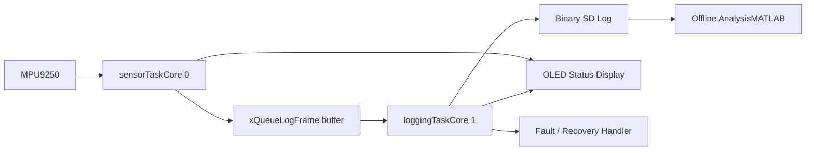

# DeadReckoner

A real-time, offline dead-reckoning and data-logging system built around the **ESP32-S3 N16R8**, the **MPU9250 IMU**, and a **binary SD-card logging pipeline**.

The project started as a small IMU prototype and evolved into a multi-core embedded platform for high-rate sensing, safe storage, fault handling, and offline analysis.

---

## Overview

DeadReckoner is designed to record high-frequency inertial data without relying on live GPS.  
The final architecture separates sensing, logging, user feedback, and recovery logic so the system can keep operating reliably in field conditions.

### Core goals

- High-rate IMU acquisition with minimal blocking
- Binary logging to SD card with deterministic frame size
- Safe shutdown and recovery during hardware faults
- Offline analysis of quaternion and acceleration data
- GNSS-ready data structure for future integration

---

## Hardware Stack

| Module                         | Role                      | Notes                                       |
| ------------------------------ | ------------------------- | ------------------------------------------- |
| **ESP32-S3 N16R8**             | Main controller           | Dual-core MCU with 16MB Flash and 8MB PSRAM |
| **MPU9250**                    | Primary IMU               | 9-axis sensing for orientation estimation   |
| **OLED 0.91-inch**             | Runtime display           | Used for status, menus, and fault messages  |
| **SD Card (3.3V DIY adapter)** | Storage                   | Finalized for stable SPI logging            |
| **EEPROM**                     | Calibration storage       | Stores sensor bias values                   |
| **S6MV2 GNSS**                 | Future positioning module | Reserved in the logging structure           |

---

## System Architecture



### Key design choices

- **Core 0** is dedicated to sensor acquisition and real-time fusion.
- **Core 1** handles blocking storage work and file management.
- A fixed-size **48-byte `LogFrame`** is used to keep the logging format stable.
- The system uses **binary writes** instead of `Serial.print()` to avoid CPU overhead.
- Faults are handled explicitly so the log file is closed safely before shutdown.

---

## Highlights

- Dual-core FreeRTOS architecture
- Queue-based producer-consumer data flow
- EEPROM-backed calibration loading
- Separate I2C paths for IMU and OLED
- SD card boot scan and sequential file naming
- MPU disconnect detection and emergency shutdown
- MATLAB binary reader for offline plotting and validation

---

## Development Status

| Subsystem                  | Status      |
| -------------------------- | ----------- |
| ESP32-S3 migration         | Complete    |
| RTOS task separation       | Complete    |
| Calibration persistence    | Complete    |
| I2C optimization           | Complete    |
| SD card logging            | Complete    |
| Binary file format         | Complete    |
| Fault detection & recovery | Complete    |
| OLED menu and diagnostics  | Complete    |
| Offline analysis tools     | Complete    |
| GPS integration            | In progress |

---

## Development Roadmap

| Phase    | Status   | Summary                                       |
| -------- | -------- | --------------------------------------------- |
| Phase 0  | Complete | Legacy prototype and sensor research          |
| Phase 1  | Complete | ESP32-S3 migration and hardware redesign      |
| Phase 2  | Complete | RTOS and multi-core architecture              |
| Phase 3  | Complete | Calibration fixes and I2C optimization        |
| Phase 4  | Complete | Hardware validation and performance testing   |
| Phase 5  | Complete | SD card storage architecture                  |
| Phase 6  | Complete | Binary logging framework                      |
| Phase 7  | Complete | Fault detection, recovery, and mission safety |
| Phase 8  | Complete | User interface and operational monitoring     |
| Phase 9  | Complete | Data analysis and validation toolchain        |
| Phase 10 | Planned  | GPS integration and time synchronization      |

---

## Validation and Analysis

The system was tested through several hardware and motion experiments:

- Static drift measurement
- Dynamic return-to-zero testing
- Vibration rejection testing
- SD card write-speed benchmarking
- Long-duration binary log validation

Offline inspection is performed through MATLAB scripts that decode the 48-byte binary frames and plot orientation and acceleration trends.

---

## Repository Structure

```text
Code_deadreckoner/
├── ESP32_S3/
├── nodeMUC8266/
├── Matlab/
└── ...
Diagram_deadreckoner/
├── SD card adaptors-3.jpg
├── SD card adaptors-4.png
├── Li-ion-battery-discharge-voltage-curve.png
└── Lipo_VS_LIIon.png
Test- Sanity Check/
└── ...
```

---

## Related Files

- `Report.md` — full architecture and progress report
- `Progress.md` — engineering timeline extracted from commit history
- MATLAB binary reader scripts for offline log visualization

---

## License

**All rights reserved.**

This repository is the intellectual property of **Alireza Sotoodeh**.  
No part of the code may be copied, modified, distributed, or used without express written permission.

© 2026 Alireza Sotoodeh
